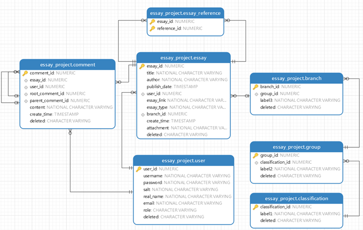

README.md
===

## 引言

### 编写目的

本文档从运行环境，架构方面，功能模块等方面对项目进行综合概述，使得对本项目能有整体的认识。

### 背景

待开发的软件系统的名称：论文管理系统

在进⾏科研任务中，⼈们常常需要阅读⼤量⽂献。随着⽂献数量的增多，需要⼀个⼯具对⽂献进⾏管理以及查找。同时针对同一个实验室，小组的情况，需要对用户权限进行管理，并且允许用户对论文发表笔记以及评论来更好达到知识共享目的。

用户群体特点：科研人员，学生，教师

## 运行环境

Java1.8+，MySQL，ElasticSearch

## 项目架构

本项目后端采用Springboot+Mybatis，前端采用Vue的前后端分离模式。客户端可以通过前端网页向后端发送数据请求，后端操作MySQL数据库，ElasticSearch和文件系统、Redis等实现项目功能。安全方面则使用自己编写的过滤器和拦截器以及结合ThreadLocal进行权限管理。

## 数据库设计

### user

* user_id: 主键自增，唯一标识一位用户
* username: 用户注册时的用户名
* password: 经过SHA256和盐共同加密的密文
* salt: 盐值
* real_name, email: 用户注册时填写的实名和邮箱
* role: 用户角色。N(normal)表示普通用户，S(super)表示管理员
* deleted: bit标识用户是否删除

### essay

* essay_id: 主键自增，唯一标识一篇论文
* title: 文章标题
* author: 作者
* publish_date: 文章的出版时间
* user_id: 此外键引用user表的user_id，标识此篇论文是哪一位用户上传的
* essay_link: 原文链接的URL
* essay_type: 五大类型，此处是枚举型
* branch_id: 此外键引用branch表的branch_id，标识这个论文是属于哪一个方向
* create_time: 论文的上传时间
* attachment: 此文章的附件，存储的是上传后能访问的URL（考虑到移植性，此处可以只存服务器端文件名的uuid）
* deleted: bit标识论文是否被删除

### essay_reference

* essay_id: 原文的id，引用essay表的essay_id
* reference_id: 被引用的文章的id，引用essay表的essay_id

### comment

* comment_id: 主键自增，唯一标识一条评论
* essay_id: 外键引用essay表的essay_id，标识是给哪一篇文章的评论
* user_id: 外键引用user表的user_id，标识是哪一个用户的评论
* parent_comment_id: 外键引用父评论的comment_id，标识此评论是评论了哪一条评论。如果本身就是直接评论文章的根评论，则此字段为null
* root_comment_id: 评论可能会来回嵌套，影响join的效率，故设置此字段来表示该评论的根评论以实现快速分类。同样，如果评论本身就是根评论，则此字段为null
* content: 评论内容
* create_time: 创建时间
* deleted: 标识是否删除

### classification, group, branch

分别标识第一、二、三级方向，树结构。

* label: 方向的名字
* deleted: 标识方向是否删除

## 实现功能模块

### 权限验证

项目中除了登录注册等，所有的接口都会进行权限验证来保证用户不会进行越权操作。实现方面采用了无状态的jwt。

用户首先需要登录来获取jwt，之后的请求都会携带jwt。在请求需要权限的资源时，后端的jwt拦截器会首先解析请求中的jwt以及其中的用户信息，并放在ThreadLocal中，如果jwt为空或解析失败则直接返回错误。解析成功则允许继续调用相关业务。

在业务中会从ThreadLocal中取出用户信息进行权限和身份验证，以确保访问用户的身份，对于通过验证的请求处理业务并返回处理结果，不通过验证的直接返回错误信息。

### 密码安全

采用SHA256加盐进行加密。明文第一次加密后再加盐乱序排列和在进行一次加密存储在数据库中。

### 用户模块

用户模块实现了用户的登录，注册功能以及更新密码。

### 论文模块

MySQL负责存储主要数据，用户信息，论文信息，方向，评论等基本信息。

ElasticSearch存储MySQL中论文的ID以及论文的标题，摘要等关键信息内容，分词存储，实现快速查询，可以看做是论文的二级索引。

文件系统则负责存储论文附件，论文的长文本内容即笔记，以及笔记的图片。

在添加论文时，会依次向MySQL添加基础数据获取ID，再向ElasticSearch添加数据，最后保存长文本内容以固定格式文件名作为索引到文件系统。

在查询论文时会先向ElasticSearch查找符合条件的论文ID，然后再在MySQL中查找ID对应的条目，通过论文ID可以直接通过文件名到文件系统获取长文本内容

### 笔记模块

笔记采用markdown的文本格式进行存储，采用例如essay_23.txt的文件名作为索引的形式进行存储。

### 评论模块

评论采用树状结构，一个论文下有多个顶层评论，一个评论下可以有多个子评论。用户可以对已上传的论文进行评论，以及回复一条评论。同时用户可以删除自己的评论。

### 文件模块

对于笔记的长文本内容以索引名进行文本文件的存储。

在后端通过文件字节码的比较来判断文件格式是否满足要求。我们规定笔记图片只能是jpeg和png，附件内容只能是zip格式。

### 管理员模块

管理员继承了普通用户的所有功能，并且可以对方向进行更新和删除，对评论进行删除，对论文进行删除，对用户进行删除以及提升用户为管理员。

### 其他

由于论文方向是可以修改和删除的，所以在前端存储固定数据并不合适，而实际情况中方向的改动并不频繁，所以我们只在用户登陆时获取一次论文的方向。由于读的频率远大于写，并且三级方向做join可能在后期数据拓展时降低性能，故在管理员将每次更新方向后的数据放在redis里，在用户登陆时就直接从redis里获取方向信息。

在新增一篇笔记时，需要添加引用的论文，即需要被引用论文的essay_id。我们想实现在输入关键字的时候自动出现匹配的可选项，选择其中的一些论文就可以将引用的essay_id添加进数据。但是将所有论文的标题和essay_id存在前端显然不合适，我们则设计在输入关键字时自动触发后端的文章标题查询，后端在Elasticsearch中分词匹配合适的项，返回由标题到essay_id的映射的Map的列表，将数据存到前端进行筛选，实现了类似缓存的功能。

